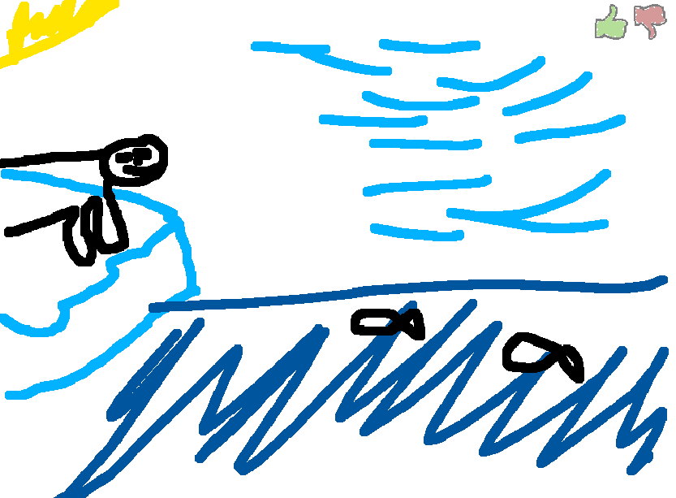
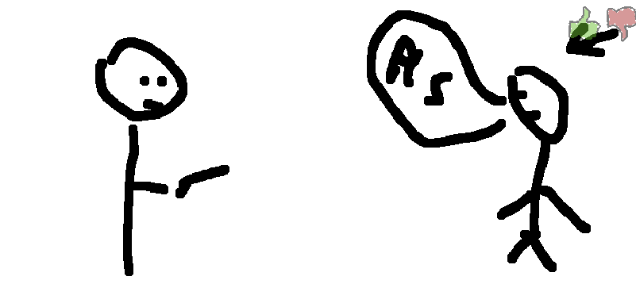

# SCRIBBLE.io
## General overview of the game
- The players each take turns drawing an image of the word they have chosen
- The players that are not drawing have to try and guess the word by typing it into the chat
- Everyone draws once per round
- Players get points depending on the order in which they guessed the word
## Rules
- `DO NOT` write the word on the screen
- `IF` someone has guessed the word, you have to stop drawing

# Examples

    
Can you guess what it is 

    

        
 It's an animal that lives in antartic

            It's a bear!!!!
    

    
Can you guess what this one is!!!! 

    

        
 It's a robbery, who's saying pls

            His a victim!!!!
    

